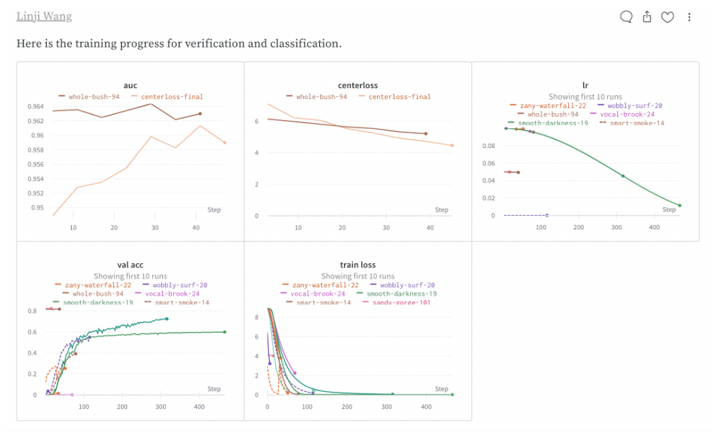

# HW2P2

#### @author: linjiw

## classification

For this homework, I started with the early submission simple network and soon find this network is not enough for the classification and verification. Then I started work on making the network deeper. However, just depth is not enough, since the network will encounter a vanishing gradient if the network is too deep and with no other techniques. Thus, the residual block becomes one of the first things I try. I used the following class and rewrite it to make it could be used for classification and verification.

```python
torchvision.models.Resnet
```

I take the last fully connected out and replace it with my own defined fully connected layers, then to make it usable for my case, I had to rewrite the forward function to get both the features and SoftMax output.


Then I started my experiment, I use this network and trained without extra augmentation. However, the performance is not enough and can only reach the medium cutoff. Thus, I started to add augmentations. The criterion I use is simple, to make the training dataset most similar to the test dataset. So I add the following transform, and I test these myself one by one with trial and errors.

```python
ttf.RandomHorizontalFlip(p=0.5),ttf.RandomInvert(p=0.01),ttf.RandomAffine(degrees=(-5,5),scale=(1,1.05)),ttf.ColorJitter(brightness=0.3,hue),ttf.Normalize((0.485, 0.456, 0.406), (0.229, 0.224, 0.225)) 
```

Here are some sample images I generated when I test the transforms.


Then, almost the major work for classification has been done, and the latter part is for the fine-tuning, I changed the learning rate by hand and through trial and error.

## verification

For the verification part, a good model in classification cannot help the verification get a high cutoff. After I read some papers, I picked Center loss to make these features easily to be separated. After adding center loss, I readjusted the weight for center loss since one good model cannot just fix on one side of the competition. After days of fine-tuning, I can reach good results for the verification.

## experiment


